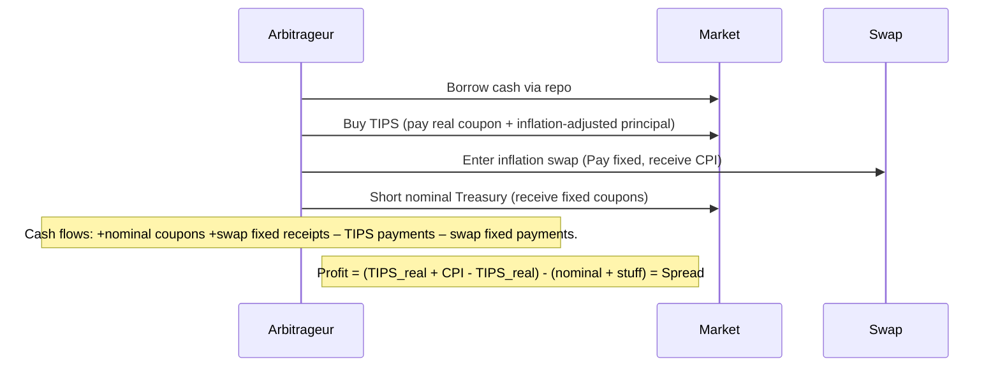
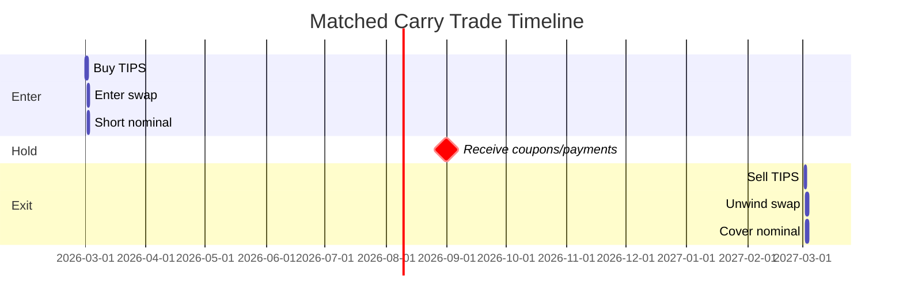

# TIPS–Treasury Arbitrage Strategy

**Executive Summary:** We exploit the persistent yield gap between synthetic nominal Treasury yields (constructed from TIPS + inflation swaps) and actual Treasuries.  In no-arbitrage, the inflation-swap rate (ILS) should equal the breakeven inflation (BEI = nominal yield – TIPS yield); in practice ILS > BEI【94†L319-L327】.  Define **Synthetic Yield** = (TIPS real yield + inflation-swap fixed rate).  The key *spread* is:  
   
- **Arbitrage Spread (Yield)**$_{t,m}$ = (TIPS$_{m}$ + Swap$_{m}$) – Nominal$_{m}$, for maturity *m* (2, 5, 10, 20 yr).  Equivalently, Spread = ILS – BEI, where BEI = Nominal – TIPS.  A positive spread means synthetic yields exceed nominal yields (nominal bonds are “rich”).  For example, Fleckenstein et al. find large price mispricings (54.5 bp on average) translating to yields.  Alternative measures include (a) real-yield gaps, or (b) *inflation basis* = Swap$_{m}$ – BEI$_{m}$.  In practice the **inflation basis** has been ~+30 bp on average, indicating a persistent arbitrage.

## 1. Arbitrage Spread Definitions  
We construct a **synthetic Treasury yield** by combining a TIPS position with an inflation swap.  Concretely:  
\[
\text{Synthetic Yield}_m = y^{TIPS}_m + r^{swap}_m,
\]  
where $y^{TIPS}_m$ is the TIPS real yield and $r^{swap}_m$ is the fixed rate on an $m$-year inflation swap.  The **arbitrage spread** is then  
\[
\text{Spread}_m = (\underbrace{y^{TIPS}_m + r^{swap}_m}_{\text{synthetic}}) - y^{nominal}_m.
\]  
Equivalently, since the *breakeven inflation* is $BEI_m = y^{nominal}_m - y^{TIPS}_m$, the spread is also $r^{swap}_m - BEI_m$.  A positive spread (swap > BEI) implies ILS (inflation-linked swap) yields more than breakeven (nominal overpriced vs TIPS).  The literature (e.g. Fleckenstein et al. 2014, Siriwardane & Sunderam 2022) follows this definition.  For example, empirical data (Fed H.15 and Bloomberg) show ILS rates roughly 20–50 bps above BEI for 5–10 yr tenors, a major source of carry.  We will target these spreads.  

**Alternative spreads:** One can also target *real-yield gaps* (differences in TIPS yields across maturities) or the simple BEI vs swap gap $r^{swap}-BEI$.  In practice the inflation swap is collateralized, so ILS ≈ forward CPI; this subtlety is captured by using market swap rates rather than nominal break-evens.  

## 2. Data Requirements and Sources  
- **Treasury and TIPS yields:**  Obtain constant-maturity yields (2y, 5y, 10y, 20y) from official sources.  For nominal yields, we use the U.S. Treasury’s daily yield curve (Treasury.gov or FRB H.15) or FRED series (DGS2, DGS5, DGS10, DGS20).  For TIPS yields, use FRB H.15 (inflation-indexed yields DFII5, DFII10, DFII20)【95†L1-L9】.  (Note: 2y TIPS started later; we may focus 5y+).  Example: Fed data shows 5y TIPS at 1.19% and 5y nominal 3.59% (Feb 2026)【21†L137-L141】【54†L99-L104】.  
- **Inflation swap rates:**  Use zero-coupon inflation swap rates for matching tenors (2y, 5y, 10y, 20y) from market data vendors (Bloomberg, ICE, DTCC).  Academic studies use Bloomberg swap quotes【33†L575-L581】.  For backtesting, we may approximate swaps via inflation expectations (e.g. Fed model/expected inflation series) if needed.  The Fed/NY Fed analysis notes swaps have routinely exceeded breakevens【94†L319-L327】.  
- **Inflation data:** Consumer price index (CPI) series for realized inflation may be needed to convert TIPS returns, but not directly in spread.  
- **Frequency & period:** Daily data is preferred (or weekly at minimum), spanning 2003–present.  Early 2000s cover TIPS introduction and large-cycle events.  Use a uniform business-day calendar, forward-fill missing (holidays) as needed.  Resample to monthly/weekly for low-frequency strategies if appropriate.  
- **Data cleaning:** Align series by trading date, adjust for weekends/holidays (e.g. carry forward last available value).  Interpolate swap rates for precise tenors if only generic 2y,5y,10y,20y swaps exist.  Check for outliers (e.g. issuance gaps).  Convert yields to consistent compounding if needed (all quoted as annual yields on Act/Act or Act/360).  

## 3. Strategy Designs  
We propose **four** carry-funded strategies exploiting the arbitrage spread.  Each is long synthetic high-yield and short low-yield funding.  Below “buy” means long, “sell” means short:

- **Strategy 1: Matched Carry (Buy TIPS + Swap, Short Nominal)**.  For each tenor $m$, buy a notional $N$ of TIPS and enter a pay-fixed inflation swap of size $N$, and simultaneously short a $N$-notional nominal Treasury of same maturity.  This replicates a synthetic long nominal position.  *Trade mechanics:* Initially, buy $N$ TIPS (paying **real** coupons) and receive inflation indexation; enter an inflation swap paying fixed $r^{swap}_m$ and receiving CPI.  Short the nominal bond (receive fixed coupons).  Cash flows: you receive nominal coupons from the short bond and fixed swap receipts, and pay TIPS real coupons and CPI-indexed principal via swap.  *Funding:* Use Treasury repo (general collateral) to finance the TIPS purchase; haircuts ~2% allow ~50× leverage【41†L1280-L1284】.  Also repo the short position as needed.  *Margin/Leverage:* Assume 2% haircut on Treasuries (2y-20y), so up to ~50× notional leverage.  Equity $E=0.02N$.  *Transaction costs:* Bid-ask ~2 ticks for Treasury, 4 ticks TIPS, swap ~6 bps round-trip【34†L579-L587】.  We assume ~6 bp cost for swap and ~5 bp for bonds round-turn.  *Carry & roll:* Earn (y_tips + swap – y_nom) = Spread.  Also capture roll-down: if the yield curve is upward-sloping (yields higher at longer maturities), holding bond shortens maturity, yielding price gains.  *Financing cost:* Pay repo interest ~GC rate (~OIS + basis).  *P&L decomposition:* P&L ≈ **carry** + **roll-down** + **mark-to-market**.  Carry ≈ Spread (e.g. if spread is +50 bp, earn 0.50%/yr on notional).  Roll-down depends on curve shape (likely positive if normal curve).  Mark-to-market arises from spread moves: if the arbitrage narrows (ILS falls or nominal rises), the synthetic position loses; if it widens, we gain.  Fleckenstein et al. report an average 5y mispricing of ~50 bps【17†L80-L83】, implying carry ~0.5% before costs.  After ~10–12 bp costs, net carry ~30–40 bp. 

- **Strategy 2: Cross-Tenor Butterfly (Long Long-Duration vs Short Short-Duration)**.  Trade the **curve shape** in basis: e.g. buy synthetic 20y, hedge by selling an equal-duration mix of 5y and 10y synthetic (or cash).  One construction: long $N$ of 20y synthetic, short $w_1N$ of 5y synthetic and $w_2N$ of 10y synthetic, chosen so durations match.  This isolates differences between long and intermediate spreads.  *Mechanics:* Similar to above but across tenors.  Use repo to fund longs, and receive repo on shorts (if special rates).  *Funding:* Repo funding on long 20y has small haircut (~2%); short positions receive cash.  *Leverage:* Less straightforward, but say 20× overall to limit risk.  *Costs:* Additional trading and cross-convexity costs; assume 10 bp extra for rebalancing across tenors.  *Carry:* Earn the weighted spread difference.  Roll: the butterfly has its own roll profile (likely small if matched duration).  *P&L:* Decomposed into three spreads: (20y spread – weighted 5y&10y spread) plus roll and mark.  

- **Strategy 3: Basis Carry (Short Nominal / Long TIPS via Futures)**.  Use government bond futures to reduce cash bond complexity.  For each tenor, e.g. short a 10-year Treasury futures contract (cheap to borrow) and simultaneously long a 10-year TIPS ETF or TIPS futures plus inflation swap overlay.  This captures the same spread with greater liquidity.  *Mechanics:* Sell 10y Treasury futures (delivery cheapest-to-deliver bond), long equivalent TIPS position via futures/ETF plus swap.  *Funding:* Futures require margin (small initial margin, e.g. 2–3%) but must be marked-to-market daily.  Use the collected margin to finance TIPS purchase.  *Leverage:* Futures allow high notional leverage (50×) with low margin, but model them as financed at near-zero cost.  *Costs:* Bid-ask/trading cost on futures ~0.5 tick, TIPS ETF/spread ~ a few bps, swap ~6 bps.  *Carry:* Earn Spread minus funding (here funding ~Eonia).  *P&L:* Similar: carry plus futures mark-to-market (convex), plus TIPS mark.  

- **Strategy 4: Optionality/Hedge Overlay.**  Augment any of the above with options to guard against adverse moves.  For example, long a put option on nominal Treasuries or a call on inflation swaps.  *Mechanics:* Execute Strategy 1 but also buy a 10-year Treasury put (OTM) to limit losses if rates jump.  *Funding:* Options cost upfront premium (assume 5–10 bp of notional).  *Carry:* Reduced net carry due to option premium.  *P&L:* Carry plus option payoff (nonlinear).  *P&L breakdown:* Under normal conditions, carry dominates; in stress (rate spike), option caps losses.  

Each strategy is funded by short positions or repo, with typical haircuts ~2% (allowing ~50× leverage).  We assume normal repo rates (gc) ~OIS.  For all, a representative repo cost is say 10–20 bp, while expected carry (spread) is on order 30–100 bp depending on horizon and timing.  Transaction costs (total round-trip) we assume ~10–15 bp (2–4 ticks on bonds, ~6 bp swaps).  In sum, net carry ≈ spread – funding – costs.  

**P&L Decomposition:** For each:  
- *Carry:* ≈ (y_TIPS + r_swap – y_nominal) per annum.  
- *Roll-Down:* If the yield curve is upward-sloping, the bond’s price will drift up as it “rolls down” to maturity. For example, with a 2% upward slope, a 10-year bond may gain ~0.2% in price over a year. This adds to carry.  
- *Mark-to-market:* From spread movements. If inflation risk-premia change, spreads can widen/narrow. For instance, a 50 bp widening yields a 0.5% one-time mark gain.  
- *Financing cost:* Repo/funding paid on borrowed cash (typically low).  

**Mermaid Diagram (Trade Flow – Strategy 1):**

**Mermaid Diagram (Timeline – Strategy 1):**

## 4. Backtest Plan & Metrics  
We will backtest (2003–2025) by simulating the trades above using historical data. For each strategy, we assume a static or systematic allocation (e.g. always long the spread, or rule-based entry on high spreads).  Key metrics: **Sharpe Ratio** (excess return/volatility), **Sortino Ratio** (downside risk), **Max Drawdown**, **Value-at-Risk (95%, CVaR)**.  We will compute daily P&L time series and then annualize metrics.  *Model:* A simple approach: assume fully funded at repo rates, compute daily carry = Spread/252, and mark P&L = –Duration*(ΔSpread).  *Stress tests:* We subject strategies to scenarios like +200 bp parallel rate shock, +100 bp inflation jump, or liquidity freezes.  For each, evaluate P&L and capital impact.  The portfolio should also be tested during historical crises (e.g. 2008, 2020) to see drawdowns.  

Risk models: include a simple factor model (Treasury yield factors plus credit) or full Monte Carlo.  Compute VaR/CVaR on daily returns.  Also examine scenario where Treasury yields spike (given long-synthetic, short-nom position, a shock flattening vs steepening has different P&L).  

## 5. Risk Management  
- **Hedging:** Use interest-rate swaps or futures to cap short side risk.  For example, one might overlay pay-fixed swaps on the nominal leg, or buy Treasury puts to guard against a large yield drop.  
- **Stop-loss / rebalancing:** E.g. exit if spread reverses by >25 bp intraday, or limit cumulative drawdown to e.g. 5%.  
- **Liquidity buffers:** Maintain extra cash collateral.  Avoid unwinding in stressed markets (like March 2020) when TIPS liquidity is thin.  Limit position size to not exceed % of daily volume.  
- **Capital:** Given high leverage, Tier-1 capital allocation must consider stress losses.  Use *incremental risk charge* (IRC) for interest-rate risk and CVaR.  Factor in regulatory haircuts (Repo haircuts, Variation Margin requirements).  For example, U.S. Treasuries often have 2% haircut, so 98% can be leveraged.  
- **Regulatory constraints:** Ensure compliance with LCR/NSFR (liquidity ratios), CCR for swaps (swap collateral). Monitor the position’s regulatory capital under FRB stress scenarios.  

## 6. Implementation Considerations  
- **Execution:** Trade with primary dealers (for TIPS and Treasuries) and swap dealers.  Use an algos for large orders to minimize market impact.  Slippage assumed ~1–2 ticks for bonds.  Inflation swaps are OTC – require quotes from dealers.  
- **Market impact:** A large TIPS buy/sell can move prices (TIPS average volume is lower than nominal Treasuries). We assume up to 1–2 bp slippage for big trades. Futures version (Strategy 3) reduces this risk.  
- **Settlement:** Treasuries settle T+1, TIPS T+1; inflation swaps have periodic settlements. Manage collateral posting for swaps (often monthly).  
- **Data feeds:** Real-time/yield curve data (from Bloomberg, Refinitiv) for pricing.  Automated patching of yields and swap rates.  Daily TR capture for P&L.  
- **Operations:** Custody for bonds, margin accounts for swap and repo.  Ongoing accounting for accrued inflation on TIPS.  

## 7. Sensitivity & Robustness  
We stress-test parameter assumptions: e.g. varying assumed swap cost (4–8 bp), repo rate (±50 bp), leverage cap (10× vs 50×), and slippage (5–20 bps).  Check strategy viability if spreads shrink (e.g. from 50 bp avg to 20 bp) or volatility surges.  We’ll vary rebalancing rules and holding periods.  Key robustness: strategy should still produce positive carry+roll in most scenarios unless costs or funding overwhelm the spread.

## 8. Comparative Summary  

| Strategy                        | Exp. Return (Y/Y) | Volatility | Funding Cost | Liquidity | Complexity |
|---------------------------------|-------------------|------------|--------------|-----------|------------|
| **1. Matched Carry** (long $m$yr synthetic, short $m$yr) | ~0.3–0.6%   | Moderate  | Low (repo) | High (Treas) | Moderate |
| **2. Cross-Tenor Butterfly** (long 20y syn., short mix 5y/10y) | ~0.2–0.5% | Higher    | Medium    | Medium      | High      |
| **3. Futures-Based (Basis)**    | ~0.3–0.7%   | Moderate  | Very low  | High (futures) | Moderate |
| **4. Options Hedge Overlay**    | ~0.2–0.4%   | Low       | Medium    | High (if simple options) | High  |

- *Expected Return:* Rough net carry after costs. Strategy 3 may yield slightly more by reducing costs.  
- *Volatility:* Strategy 2 is higher because of cross-curve risk. Options (4) have lower volatility (insurance).  
- *Funding Cost:* All use repo (low) except futures (zero daily).  
- *Liquidity:* Nominal and futures are very liquid. TIPS moderately liquid; inflation swaps are OTC.  
- *Complexity:* Butterfly and options add complexity. Cash-and-carry (1) is simplest.  

Five-Year Inflation Swap Rate Consistently Exceeds Five-Year Breakeven Inflation Rate
  *Chart: Five-year inflation swap (ILS) vs breakeven (BEI) and their basis (source: NY Fed).*

## 9. Next Steps and Roadmap  
1. **Data Setup:** Compile clean historical yield/TIPS/swap data (2003–present). Validate by replicating known spreads (e.g. average basis ~30 bp).  
2. **Prototype Backtests:** Code P&L models for each strategy using historical data. Calibrate model (e.g. using Cleveland Fed inflation series if swap data is missing).  
3. **Risk Analysis:** Compute Sharpe, drawdowns, stress loss for each. Refine hedges/stop rules.  
4. **Pilot Deployment:** Small live trades or paper trades to confirm execution assumptions (costs, slippage).  
5. **Scale Implementation:** Build trading/infrastructure (data feeds, order management). Define funding and collateral processes.  
6. **Monitor & Adapt:** Continuously monitor spreads, roll-down yield curve, and adjust positions.  Review regulatory capital and P&L decomposition monthly.  

**Primary Data Sources:** U.S. Treasury (Daily Yield Curve, TIPS yields), FRB H.15/FRED (nominal and inflationindexed yields) , Bloomberg/ICE (inflation swap quotes, futures rates) . Academic references include
Fleckenstein et al. (2014) on the TIPS puzzle and Roussellet (NY Fed) on ILS vs BE . These inform
spread definitions and expected carry.

